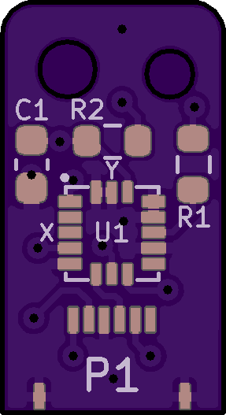
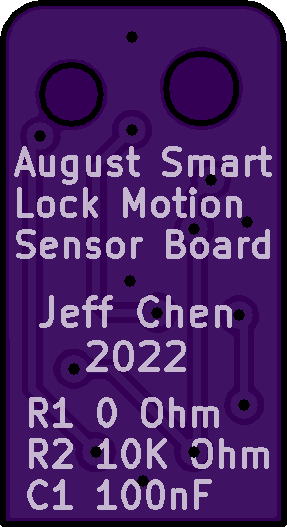
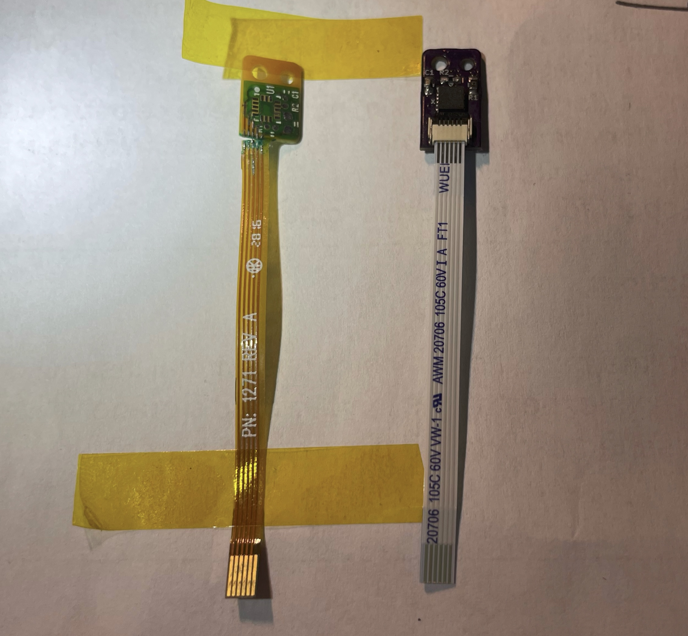
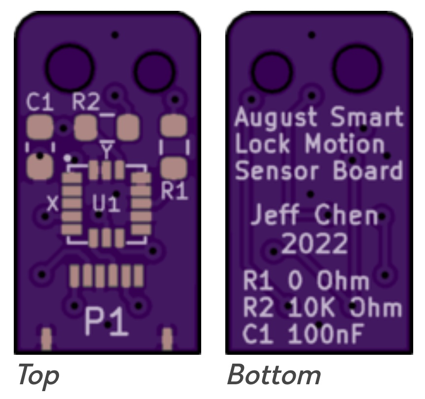
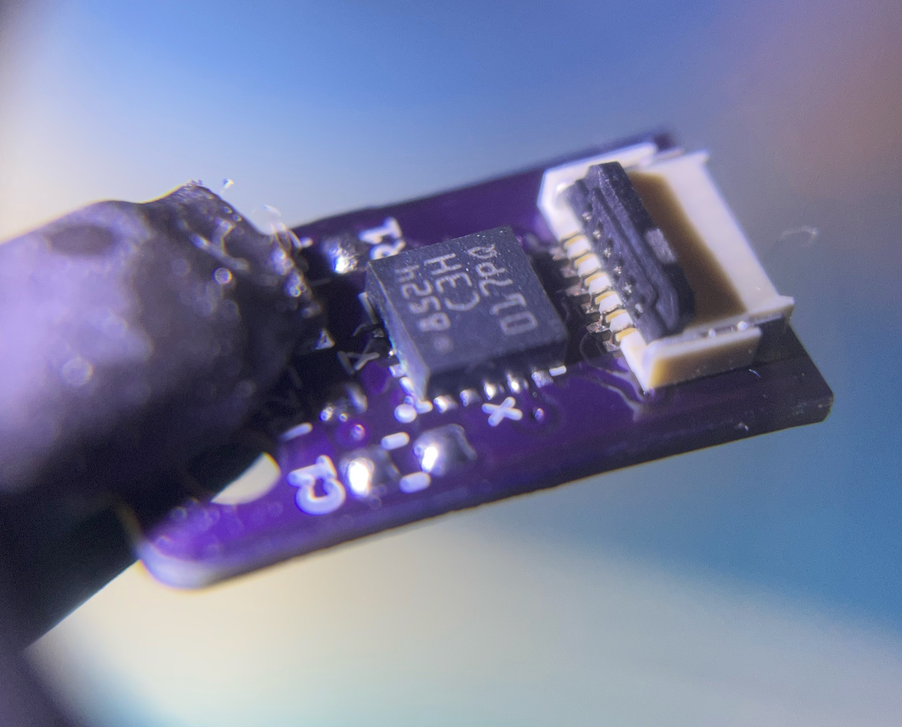
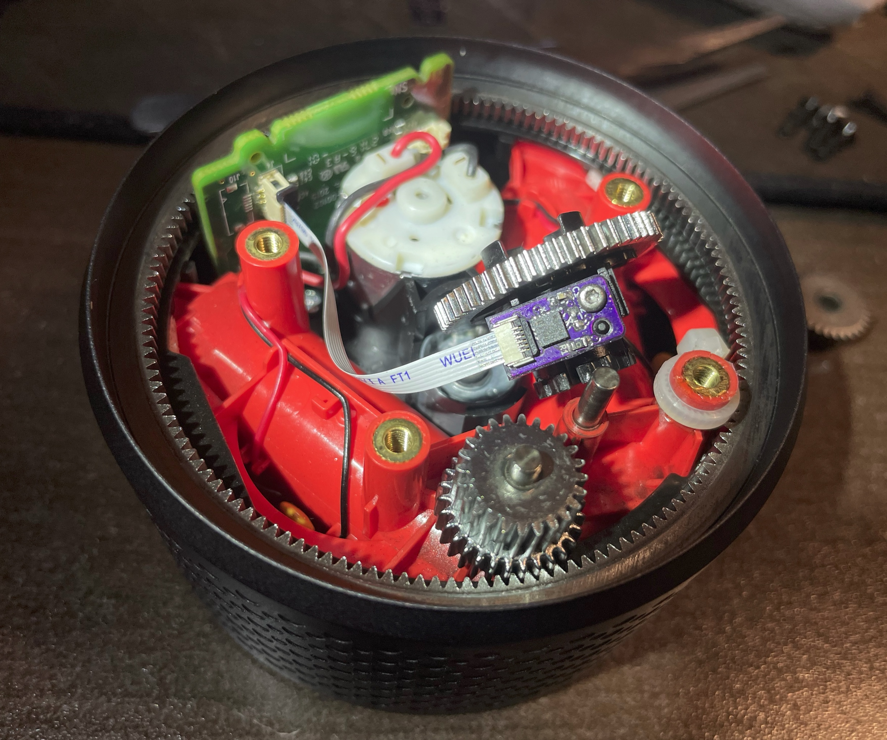

# August Smart Lock Gen2 DIY Motion Board

The 2nd Generation August Smart Lock has a design flaw - its motion sensing board has a fused ribbon cable design that conveniently connects to the main board.

With the lock rotating back and forth over the years, the joint where the ribbon cable meets the rigid PCB backing is fatigued and will eventually snap. This will mark the end of the part, and as well as the lock itself.

The lock will be unable to tell its current position. When powered on, the LED will flash red. The lock will be able to unlock but unable to lock again, end up in a stuck state, complaining that something went wrong. Attempting to recalibrate the lock will fail as well.

 

With this DIY PCB, you will be able to transfer the chip from the broken board, and connect the board to the main board with a socketed ribbon cable connector. Even if the ribbon cable breaks again in the future, you will just have to swap in another ribbon cable, which is much easier.

---------
## Parts

-  [PCB](https://oshpark.com/shared_projects/Z0Jr2p2V) (remember to order with 0.8mm thickness)

### Passive parts

You can transfer these from the old board, or use SMD 0603 size ones instead.

- 0 Ohm Resistor
- 10K Ohm Resistor
- 100nF Capacitor

### Chip

The main chip on the board, looks like to be MEMS accelerometer from STM, probably a LIS3DHTR. I suggest you transfer this chip from the old board to the new one for the best result.

### Ribbon Cable & Connector

I used a 6 position FPC cable and corresponding socket to connect to the main board.

- 6 Position 0.5mm Pitch FPC & Connector - [Link](https://github.com/jeffqchen/JeffParts/blob/main/Connectors/6%20Position%200.5mm%20Pitch%20FPC%20%26%20Connector/info.md)

You may also choose to use the 100mm version of the flex cable if 50mm is too short for you. You will have to make a loop to route the extra length inside the shell, but it's better than ripping the connector off of the PCB.

---------
## Assembly

The knowledge on how to use a hot air rework station is required for this DIY board.

For the accelerometer chip, all pads on both the chip and the PCB have to be well-tinned. Heat the chip from either top or bottom of the PCB in order to melt it onto the PCB.

For the connector, use proper amount of tin or solder paste on the pads, place the connector, and then apply hot air from THE BOTTOM of the PCB in order to solder the connector into place. Note the black locking tab is on the back of the connector, not the front, unlike what you usually see.

For the rest of the passive components, you can either put in replacement 0603 ones, or transfer the original ones from the official PCB - although this is more challenging due to their tiny size.

And finally, plug in the FPC with contacts facing up into the connector, then close the tab on the back of the connector

---------
## Installation

How the original came out, you put the replacement right back in the same way.

If this is your first time taking apart the lock, you must pay attention to the orientations of the outer ring and the center gear/PCB assembly. Otherwise the lock will end up in a weird position, making using it very awkward, or even snapping/breaking the new flex cable or PCB you just put in when you attempt to turn the lock.

Using the 100mm flex cable and carefully routing the extra length inside the lock seem to fare better than just using the 50mm cable, which felt slightly too short and introduced too much tension on the two ends of the flex cable.

---------
## Notes

After installing this PCB, the connector fell off the board after a few days of use, and had to be re-soldered. This is why I suggest trying the 100mm FPC instead of the 50mm one. You might also want to strengthen the connector with super glue or a section of metal wire. But after all, it's better than something that breaks and become unfixable.

---------
Shield: [![CC BY-SA 4.0][cc-by-sa-shield]][cc-by-sa]

This work is licensed under a
[Creative Commons Attribution-ShareAlike 4.0 International License][cc-by-sa].

[![CC BY-SA 4.0][cc-by-sa-image]][cc-by-sa]

[cc-by-sa]: http://creativecommons.org/licenses/by-sa/4.0/
[cc-by-sa-image]: https://licensebuttons.net/l/by-sa/4.0/88x31.png
[cc-by-sa-shield]: https://img.shields.io/badge/License-CC%20BY--SA%204.0-lightgrey.svg
